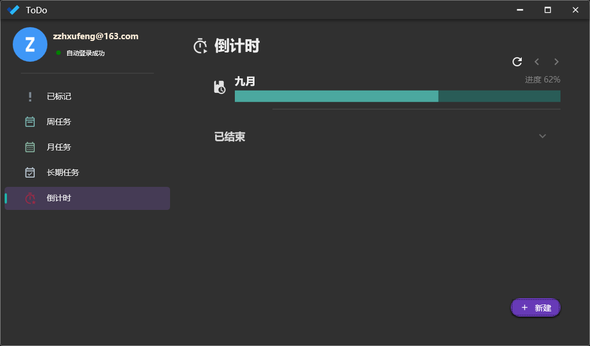

# 项目概述

本项目用于自用及学习交流.

WebAPI项目已发布在服务器. 可以下载Release应用在WPF中注册账号后日常使用.

## WPF

- Prism.DryIoc
	- 依赖注入
	- 导航
	- Dialog
	- MVVM
	- 事件
- Refit
- Material Design
- 自定义控件

## Web API

- EFCore
- 工作单元
- AutoMapper
- DTO
- Identity
- Jwt

# 源码说明

出于安全性考虑, 有一些代码未加入版本控制, 因此需要手动修改和添加一些内容才能够通过编译.

在Release的应用中对部分dll进行了混淆.

# 示例图

# 还可以做的

- [ ] VM间同步更新
- [ ] Polly
- [ ] Validators
- [ ] 动画
- [ ] 单元测试 CI/CD
- [ ] 其它

